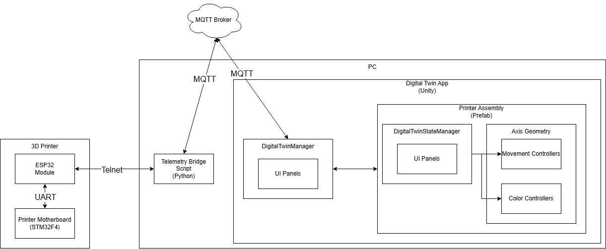

# Programming Digital Twins

## Lab Module 10 README.md

Be sure to implement all the requirements listed at [PDT-INF-10-001 - Lab Module 10](https://github.com/programming-digital-twins/pdt-exercise-tasks/issues/18).

### Description

INSTRUCTIONS: Describe, in your own words, the high-level functionality of this lab module by answering the questions listed below.

What does your implementation do? 
This module implements the complete integrated 3D printer digital twin in the DTA. It allows live tracking of printer movement and temperatures during print operations. A mesh of the specific 3d printer used in this setup (Creality CR-10S) is shown in the scene. The user can orbit and zoom on this model. The three axes of the printer mesh move to reflect the incoming telemetry moves from the real printer. As the nozzle and bed move, colored points are deposited in the move locations. The color of these points reflects deviation from the programmed extruder temperature, with green representing optimal temperature, and red/blue representing over/under temperature respectively. The bed is colored in the same scheme to represent deviation from the programmed bed temperature. As the print progresses with more movement, the cloud of points represents the shape of the printed part, with the colors giving a spatially accurate record of the print temperature accuracy over the course of the print. A UI panel reports the instantaneous temperature of both the bed and extruder, has a button to clear the print history dots, and has buttons to toggle the visibility of the connection and printer digital twin provisioning panels. 

How does your implementation work?
The base source of telemetry is the printer motherboard itself. The printer firmware exposes two telemetry commands; M105 which reports the temperatures of the bed and extruder, and M114 which reports the position of the three axes of the printer. A connector on the motherboard allows the installation of an ESP32 daughterboard, which is connected to one of the motherboard UART ports. The ESP32 and motherboard establish full-duplex communication through G-codes over this UART. The ESP32 exposes a telnet port by which commands can be sent and recieved from external devices over LAN. A python script running on the PC connects to the ESP32 over this telnet port and to an MQTT broker on the same LAN. The bridge script publishes telemetry to the broker in the same format as the EDA, as expected by the DTA. The bridge script supports both simulated and real telemetry modes. In simulated mode, the bridge script generates and publishes simulated telemetry of the axis positions and temperatures, simulating movement and temperature fluctuation during a print. In real mode, the bridge script sends M105 and M114 commands to the printer via the ESP32 at regular polling intervals. The response of these commands is then parsed for telemetry updates on the axis positions and temperatures. The values are then formatted and published to the broker. In both modes, the bridge script subscribes to a command topic by which it can recieve commands from the DTA, such as changes to temperatures or printing speed override. Commands parsed from published messages on these topics re then passed to the printer via the ESP32. The DTA connects to the broker and subscribes to the telemetry topics. A DTDL model for the printer specifies the structure of telemetry updates expected on these topics, and when new telemetry is published it passes the values on the the printer assembly game object. The printer contains the relevant digital twin scripts and UI panels, like in the digital twin asset prefabs presented in the CFW package. As in this DTA scene all telemetry sources come from the same EDA instance and there is only one digital twin asset to parse them, provisioning is handled automatically by name matching rather than manually as in the original CFW. The printer prefab contains gameobjects for the root of each of the three axes, parented appropriately to reflect the movement structure of the real printer. Movement controller scripts have been attached to each axis. The DigitalTwinStateManager of the printer prefab sends parsed telemetry updates to the appropriate axis movement controller, scaled from real world units to scene units. The axis movement controllers then move the axes and child objects to the appropriate position. Secondary movement of assembly components such as the rotation of belt sprockets and lead screws is triggered by these movement controllers and handled by other controller scripts attached to these components. A spline representing the bowden tube is simulated between the Z axis and hotend assemblies. A script was attached to the hotend assembly that spawns colored dots at the nozzle tip before each new telemetry move, and sets the color of that dot based on the extruder temperature telemetry. This controller triggers a movement controller for rotation of the extruder fan based on extruder temperature, analogous to the secondary component movement in the axis assemblies. A script was attached to the bed which changes the material base color of the bed based on the bed temperature, analogous to the color setting of the nozzle dots. 

### Design Diagram(s)

INSTRUCTIONS: Include one or more design diagram(s) representing your solution.

### Specific Features

INSTRUCTIONS: List the specific features implemented (or integrated) as part of this lab module. Preface each with either 'EDA' (for the Edge Device App) or 'DTA' (for the Digital Twin App). Keep each feature as concise as possible - e.g., 'EDA: Connects to MQTT broker' or 'DTA: Consumes EDA telemetry via MQTT'.

- 
- 
- 

EOF.
